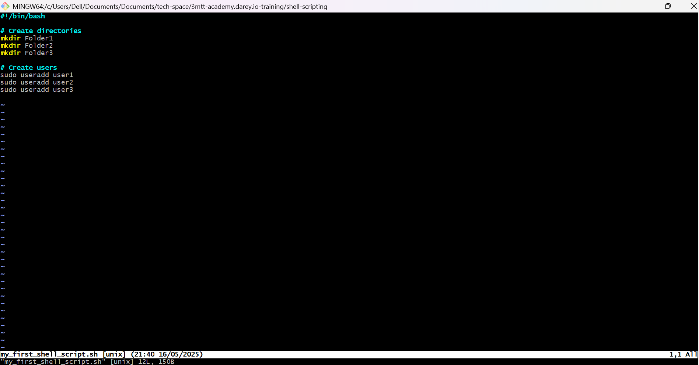
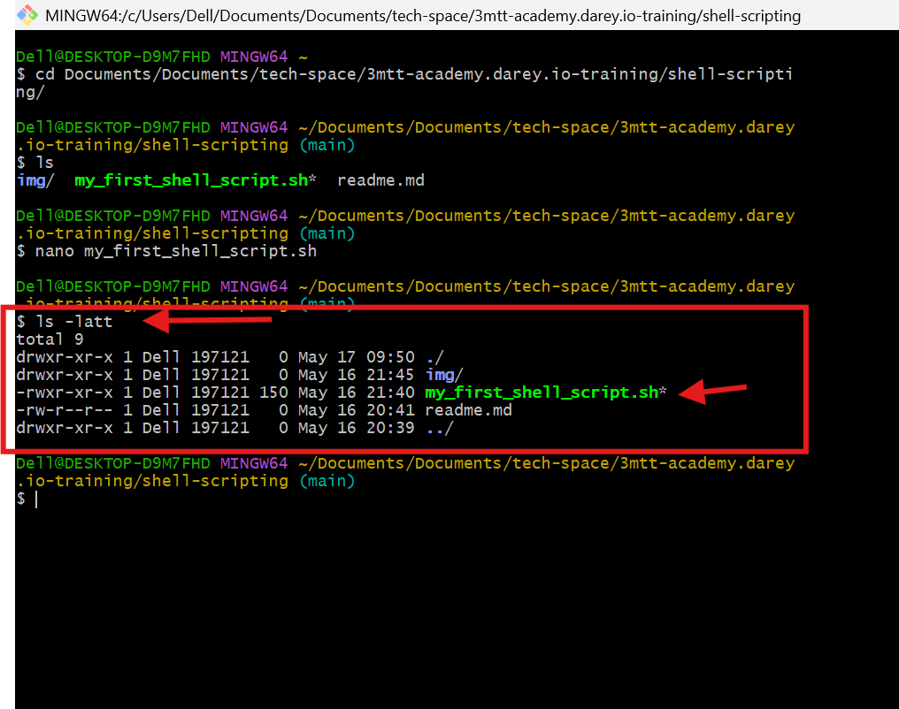

# Shell Scripting  

## Project Description  
Shell scripting automates repetitive tasks by writing sequences of shell commands in a script. Instead of manually executing commands one by one, a shell script bundles them into a reusable program. This is especially useful for system administration, file management, and batch processing.  
 
Imagine you're tasked with setting up new workstations and user accounts regularly at your job. Instead of manually creating each folder and user account, a simple shell script can efficiently get the job done. By automating the creation of multiple directories and user accounts with just a few lines of code, it saves you considerable time and effort.  

## What is Shell Scripting?  
Shell scripting is the process of writing and executing a series of instructions in a shell (e.g., **Bash, sh, zsh, or PowerShell**) to automate tasks. A shell script is essentially a program written in a shell language.  

### Example Use Case  
A basic shell script can:  
- Create multiple directories.  
- Create multiple Linux users at once.  


---

## Tasks & Solutions  

### 1. Create and Execute a Shell Script  
**Task:**  
- Create a folder named `shell-scripting` on an Ubuntu server.  
- Use `vim` to create a file `my_first_shell_script.sh` with the following content:  

```bash
#!/bin/bash

# Create directories
mkdir Folder1
mkdir Folder2
mkdir Folder3

# Create users
sudo useradd user1
sudo useradd user2
sudo useradd user3
```




#### Steps:

1. Navigate into the directory.
    - Run command `cd shell-scripting`

2. Save and verify file creation (`my_first_shell_script.sh`).
  
  
   - Run command `ls -latt`

   


    - Key Observations:

       File permissions (-rw-r--r--) mean:
       Owner: Read + Write

       Group/Others: Read only

       Execute permission is missing, so running ./my_first_shell_script.sh will fail.

       `bash: ./my_first_shell_script.sh: Permission denied`

       

3. Fix Permissions and Execute.
   
   **Task** 

   - Add execute permission for the owner.
     
     Run command `chmod u+x my_first_shell_script.sh`

   - Run the script.
    
     Run command ` ./my_first_shell_script.sh` 

   - Verify outputs by checking if folders and users was created.
     
     Run command to check for folders ` ls`

     
    
     Run command to check user `id user1  # Example output: uid=1000(user1) gid=1000(user1) groups=1000(user1)`
     
     

### NOTE:  Understanding the Shebang Is Important (#!/bin/bash)
The shebang (#!) specifies the interpreter (e.g., /bin/bash).

Without it, the script may not execute properly.

Example alternatives:

#!/bin/sh for the default shell. 


4. Variables in Shell Scripting

Example:

`name="John" echo $name    # Output: John`

`echo "My name is $name"  # Output: My name is John`

Key Points:

- Use = to assign values (no spaces around =).

- Prefix variable names with $ to retrieve values.

- echo prints variables/text to the console.


